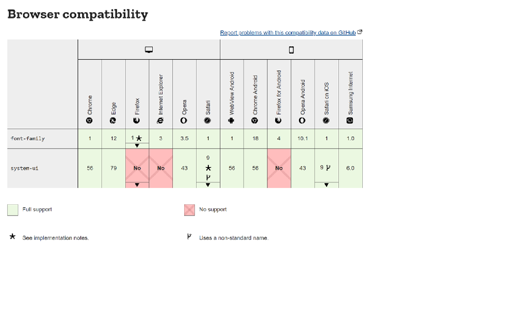

# Reading 5 Design web pages with CSS
## What is CSS
ToC
* What is CSS for?
* CSS syntax
* CSS modules
* Browser support information
* Browser compatibility
* What's next
* In this module

### CSS First Steps
    * CSS- Cascading Style Sheets 
        * Is used to style and lay out webpages, ie font, color, size, and spacing
### What is CSS for?
    * a language for specifying how a doc is presented to users
        * Document- a text file structued using a markup language
        * Presenting- converting the text file to a form usable in a browser by the end user.
### CSS Syntax
    * CS is rule based language- I define rules specifying groups of styles that should be applied.
        example
        "I want the main heading on my page to be shown as large red text."
        h1{
            color: red;
            font-size: 5em;
        }
        rule opens with a selctor- h1
        declartions- {} filled with property and value ie collor and font-size
### CSS Modules
    *MDN? 
    * basicly CCS is a language, broken down into modules. 
### CSS Specifications
    * all web standards technologies (HTML, CSS, JavaScript, ect) are defined in giant documents called specifications (or "specs"), which are published by standards organizations (such as the W3C, Whatwg, Ecma, or Khronos).
    * CSS is no different- devel by a group withing the W#C called the CSS working Group.
    * CSS is updated, but never in such a way to make older webpages using older CSS, break and unuseable.
### Browser Support Information
    

## How to Add CSS
    ### Three ways to insert CSS
        * External CSS
            * external style sheet, can change the look of an entire website by changing just one file.
            * <link rel="stylesheet" href="mystyle.css">
            * should not contain any HTML tags
        * Internal CSS
            * may be used if one single HTML page has a unique style
            * ```body{
                background-color: linen;
            }
            h1 {
                color: maroon;
                margin-left: 40px;
            }```

        * Inline CSS
            * ```<h1 style="color:blue;text-align:cener;"></h1>```
            * ```<p style="color:red;"></p>```
    ### Multiple Style Sheets
## CSS Color Property
    * body{
        color: red;
    }
    * h1{
        color: #00ff00;
    }
    * p.ex{
        color: rgb(0,0,255);
    }
### CSS Syntax
    *color: color|initial|inherit;

### Examples
    * hex value
        * body {color: #92a8d1;}
    * RGB value
        *body {color: rgb(201, 76, 76);}
    * RGBA value
        *body {color: rgba(201,76,76, 0.6);}
    * HSL value
        * body {color: hsl(89, 43%, 51%);}

